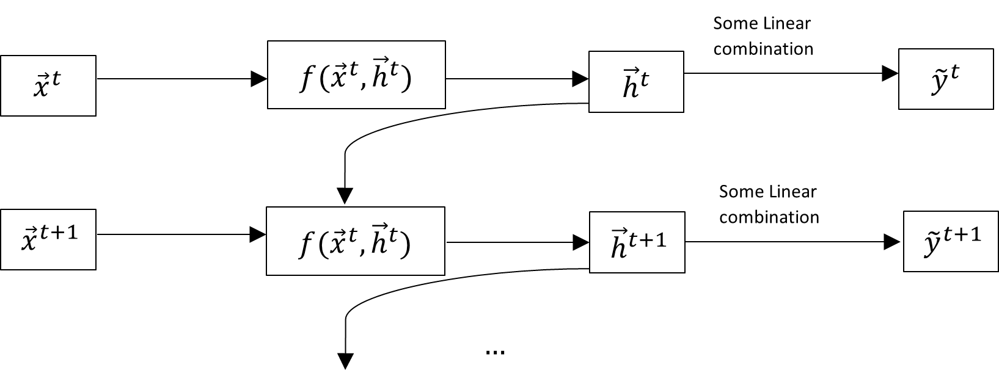
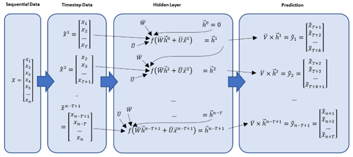

```{r include = FALSE}
# Libraries used 
library(ggplot2)
library(ggpubr)
library(reshape2)
library(tensorflow)
library(tidyverse)
library(lubridate)
library(data.table)
library(progress)
library(keras)
library(caret)
library(lubridate)
library(scales)
library(plotly)
```

# Pre-Requisites (Covered in Week 3-5)
1. Neural Networks: The Theory behind Neural Networks 
2. Back Propagation: Working back from output nodes to input nodes. 
3. Activation Functions: Sigmoid, Hyperbolic, ReLU, Softmax

# What is a Recurrence Neural Network? 
A Recurrent Neural Network (RNN) is a basic form of neural network designed to deal with sequential data, such as time series or Natural Language Processing (NLP). 

A RNN, like any other Neural Network, is made up of weights, biases, layers, and activation functions. A RNN also has an additional functionality which is the feedback loop. The key principle underlying RNNs is that they can keep a "memory" of prior inputs, allowing them to make predictions based on both the present and previous inputs. Thereby, the feedback loop is used to predict sequential input values over time. 

## Common types of RNN; 
1. One-to-One
2. One-to-Many
3. Many-to-One (Long Short Term Memory Network LSTM)
4. Many-to-Many

## Motivating Example: Predict Stock Prices. 

Company A  IPO's (went public) 50 days ago, while Company B IPO's (went public) 10 days ago. We want to utilize a Neural Network to forecast stock values for the different companies in such a way that:

1. Each company's input is independent. We want to use 50 days of data from Company A and 10 days of data from Company B. 
2. The Neural Network must be adaptable in terms of the amount of Sequential Data utilized to produce a forecast. 


### Following Neural Networks taken into consideration: 
#### Single/Multiple Neural Networks: 
Input value can only be fixed (Eg- 1 day, 5 days etc). This doesn't make sense in terms of predicting the stock price of a company by only using limited data. This is because, every dataset is important in this case and past data from earlier days cant be ignored.

#### Recurrence Neural Network: 
RNN can be used to predict companies stock prices based on their inputs independently. The feedback loop is used to predict sequential input values over time. 

# RNN Theory
Let us say that we have a sequential data $X = \{ x_{1},x_{2},x_{3},\ldots,\ x_{n}\}$ and we want to use RNN to "learn" the pattern of the data to predict future data.

We can use a Timestep of the Data, of length $T$, to predict the next $K$ values in the dataset

$$use\ {\overrightarrow{x}}^{t} = \begin{bmatrix}
x_{t} \\
x_{t + 1} \\
\ldots \\
x_{t + T-1} \\
\end{bmatrix}\ to\ predict\ {\widetilde{y}}^{t} = \begin{bmatrix}
{\widetilde{x}}_{t + T } \\
{\widetilde{x}}_{t + T + 2} \\
\ldots \\
{\widetilde{x}}_{t + T + k -1 } \\
\end{bmatrix}$$

We can use Moving Averages to do this, however, doing so may cause results to not be accurate in predicting the next data in the series. 

Therefore, in RNN, there is a "memory element" that is used in the prediction, such that the previous data in the sequence affects the future predictions. Let us call that the hidden vector ${\overrightarrow{h}}^{t}$.

This "memory element" should also store some information about the prediction ${\widetilde{y}}^{t}$. So we can compute
${\widetilde{y}}^{t}$ as some linear combination of ${\overrightarrow{h}}^{t}$.

## Simple Flow of RNN

```{r echo=FALSE, out.width = '150%'}

```
With this flow in mind, we can construct the recursive equation for the hidden vector ${\overrightarrow{h}}^{t}$ and the prediction
${\widetilde{y}}^{t}$ as such:

$${\overrightarrow{h}}^{t} = f\left( \overline{W}{\overrightarrow{h}}^{t - 1} + \overline{U}{\overrightarrow{x}}^{t} \right),\ \ \widetilde{y} = \overline{V}{\overrightarrow{h}}^{t}\ $$

Where we define the following Weight parameters and Vectors

Weight Parameters

 - ${\overline{W}}_{J \times J} \Rightarrow$ Weighing Parameter for the previous hidden vector ${\overrightarrow{h}}^{t - 1}$
 
 - ${\overline{U}}_{J \times T} \Rightarrow$ Weighing Parameter for the timestep data ${\overrightarrow{x}}^{t}$
 
 - ${\overline{V}}_{K \times J} \Rightarrow$ Weighing Parameter for the hidden vector ${\overrightarrow{h}}^{t}$ to compute the prediction ${\widetilde{y}}^{t}$
 
 
 
 - ${\overrightarrow{x}}^{t}$ $\epsilon$ $R^{T} \Rightarrow$ Time step Data
 
 - ${\overrightarrow{h}}^{t}\epsilon R^{J} \Rightarrow$ Hidden Vector
 
 - ${\widetilde{y}}^{t}\epsilon R^{K}\Rightarrow$ Prediction

Dimensional Parameters

-   $T \Rightarrow$  Length of Time step

-   $K \Rightarrow$ Output Dimension

-   $J \Rightarrow$ Dimension of hidden vector

### Activation Function for RNN
Various Activation functions can be used for the hidden layer in RNNs, such as  Sigmoid Function, Rectified Linear Unit (ReLU).


$$f(x) = \sigma(x) = \frac{1}{1 + exp( - x)} $$
```{r echo = FALSE, fig.width=4, fig.height=3, fig.align='center'}
# Define the sigmoid function
sigmoid <- function(x) {
  return (1 / (1 + exp(-x)))
}

# Create a sequence of values to plot the sigmoid function over
x <- seq(-10, 10, length.out = 100)

# Calculate the y values of the sigmoid function for each x value
y <- sigmoid(x)


df1 <- data.frame( x , y )
# Plot the sigmoid function

ggplot( df1, aes(x,y) )+
    geom_line(color = "blue") +
  xlab("Input") +
  ylab("Output") +
  ggtitle("Sigmoid Function")+
  theme_minimal() 


```

$$f(x) = \max(0, x)$$

For this example, we will be using the Sigmoid Function. So the formula for the hidden vector would be as such:

$$
\overrightarrow{h}^{t} = \sigma \left( \overline{W} \overrightarrow{h}^{t - 1}  + \overline{U} \overrightarrow{x}^{t} \right)
$$
$$
\widetilde{y} = \overline{V}{\overrightarrow{h}}^{t} = \overline{V}\sigma\left( \overline{W}{\overrightarrow{h}}^{t - 1} + \overline{U}{\overrightarrow{x}}^{t} \right)
$$

## RNN Architecture

Thereby, the RNN Architecture is as such;

```{r pressure, echo=FALSE, out.width = '100%', fig.align='center'}

```

### Back Propogation Through Time (BPTT)

The weight matrices ${\overline{V}}_{K \times J}, {\overline{U}}_{J \times T}$, and $\overline{W}_{J \times J}$ are updated during training using Back propagation through time (BPTT), which is a variant of back propagation that is used for training recurrent networks. During BPTT, the gradients are calculated recursively through the time steps, allowing the network to learn the temporal dependencies in the data.

Based on the prediction values ${\widetilde{y}}^{t}$ and actual values ${\overrightarrow{y}}_{i} = \begin{bmatrix}x_{t + T } \\x_{t + T + 1} \\\ldots \\x_{t + T + k-1} \\\end{bmatrix}$, we can compute the Loss Function $L$ as follows:

$$L = \frac{1}{2}\sum_{i = 1}^{n - T + 1}\left( {\widetilde{y}}_{i} - y_{i} \right)^{2}$$

In finding the partial derivatives, it is worth noting the derivative of
the sigma function can be simplified as:

$$\sigma^{'}(x) = \sigma(x)\left( 1 - \sigma(x) \right) \\
 \text{ } \\
{\overrightarrow{h'}}^{t} = {\overrightarrow{h}}^{t}\left( 1 - {\overrightarrow{h}}^{t} \right)$$

From the loss function, we can thus compute the following partial
derivatives of the weighting parameters, $\frac{\partial L}{\partial\overline{W}}$,  $\frac{\partial L}{\partial\overline{U}}$, $\frac{\partial L}{\partial\overline{V}}$:

$$\frac{dL_{i}}{dV_{\alpha\beta}} = \frac{\partial L_{i}}{\partial{\widetilde{y}}_{j}}\frac{\partial{\widetilde{y}}_{j}}{\partial V_{\alpha\beta}} = \left( {\widetilde{y}}_{i} - y_{i} \right)h_{k}$$

$$
\frac{dL}{d\overline{V}} = \sum_{i = 1}^{n - T + 1}{\left( {\widetilde{y}}_{i} - y_{i} \right)h_{k}} \\
 \text{ } 
$$
$$ \frac{dL_{i}}{dU_{\alpha\beta}} =  \frac{\partial L_{i}}{\partial{\widetilde{y}}_{j}}\frac{\partial{\widetilde{y}}_{j}}{\partial h_{k}}\frac{\partial h_{k}}{\partial U_{\alpha\beta}} $$

$$= \left( {\widetilde{y}}_{i} - y_{i} \right)\left( V_{ij} \right)\left( f^{'}\left( \overline{W}{\overrightarrow{h}}^{t - 1} + \overline{U}{\overrightarrow{x}}^{t} \right) \right)\left( {\overrightarrow{x}}^{i} \right)$$

$$= \left( {\widetilde{y}}_{i} - y_{i} \right)\left( V_{ij} \right)\left( {\overrightarrow{h}}^{t}\left( 1 - {\overrightarrow{h}}^{t} \right) \right)\left( {\overrightarrow{x}}^{i} \right)$$

$$\frac{dL}{d \overline{U}} = \sum_{i = 1}^{n - T + 1}{\left( {\widetilde{y}}_{i} - y_{i} \right)\left( V_{ij} \right)\left( {\overrightarrow{h}}^{t}\left( 1 - {\overrightarrow{h}}^{t} \right) \right)\left( {\overrightarrow{x}}^{i} \right)}
 \text{ } \\
$$
$$
\frac{dL_{i}}{dW_{\alpha\beta}} = \frac{\partial L_{i}}{\partial{\widetilde{y}}_{j}}\frac{\partial{\widetilde{y}}_{j}}{\partial h_{k}}\frac{\partial h_{k}}{\partial W_{\alpha\beta}} \\
$$

$$
= \left( {\widetilde{y}}_{i} - y_{i} \right) \left( V_{ij} \right) \left( f^{'}\left( \overline{W}{\overrightarrow{h}}^{i - 1} + \overline{U}{\overrightarrow{x}}^{i} \right) \right) \left({\overrightarrow{h}}^{i - 1} \right)
$$

$$\frac{dL}{dW} = \sum_{i = 1}^{n - T + 1}{\left( {\widetilde{y}}_{i} - y_{i} \right)\left( V_{ij} \right)\left( {\overrightarrow{h}}^{i}\left( 1 - {\overrightarrow{h}}^{i} \right) \right)\left( \ {\overrightarrow{h}}^{i - 1} \right)}$$

#### Gradient Descent

$$W_{\alpha\beta} \rightarrow W_{\alpha\beta} - \varepsilon\frac{dL}{dW_{\alpha\beta}}$$

$$U_{\alpha\beta} \rightarrow U_{\alpha\beta} - \varepsilon\frac{dL}{dU_{\alpha\beta}}$$

$$V_{\alpha\beta} \rightarrow V_{\alpha\beta} - \varepsilon\frac{dL}{dV_{\alpha\beta}}$$

## Algorithm

Initialize Parameters

 - $\overline{W} = 0, \overline{V} = 0, \overline{U} = 0$

 - $\overrightarrow{h}^{0} = 0$

Iterate for N epochs


&nbsp;&nbsp;&nbsp;&nbsp;&nbsp; From t =1 to n-T+1 

&nbsp;&nbsp;&nbsp;&nbsp;&nbsp;&nbsp;&nbsp;&nbsp;&nbsp;&nbsp; Get ${\overrightarrow{x}}^{t} = \begin{bmatrix} x_{t} \\ x_{t + 1} \\ \ldots \\ x_{t + T} \\ \end{bmatrix}$

&nbsp;&nbsp;&nbsp;&nbsp;&nbsp;&nbsp;&nbsp;&nbsp;&nbsp;&nbsp; Find the hidden vector from previous hidden vector
  
     
$${\overrightarrow{h}}^{t} = f\left( \overline{W}{\overrightarrow{h}}^{t - 1} + \overline{U}{\overrightarrow{x}}^{t} \right)$$

&nbsp;&nbsp;&nbsp;&nbsp;&nbsp;&nbsp;&nbsp;&nbsp;&nbsp;&nbsp; Compute predictions
$${\widetilde{y}}_{t} = \overline{V}{\overrightarrow{h}}^{t} = \overline{V}f\left( \overline{W}{\overrightarrow{h}}^{t - 1} + \overline{U}{\overrightarrow{x}}^{t} \right)\ \forall t = 1,\ 2,\ ...n - T + 1$$

&nbsp;&nbsp;&nbsp;&nbsp;&nbsp; Compute Partial Derivatives and update Parameters

$$\frac{dL}{d\overline{V}} = \sum_{i = 1}^{n - T + 1}{\left( {\widetilde{y}}_{i} - y_{i} \right)h_{k}}$$

 $$\overline{V} \rightarrow \overline{V} - \varepsilon\frac{dL}{d\overline{V}}$$

 $$\frac{dL}{d\overline{U}} = \sum_{t = 1}^{n - T + 1}{\left( {\widetilde{y}}_{t} - y_{t} \right)\left( V_{tj} \right)\left( {\overrightarrow{h}}^{t}\left( 1 - {\overrightarrow{h}}^{t} \right) \right)\left( {\overrightarrow{x}}^{t} \right)}$$

$$\overline{U} \rightarrow \overline{U} - \varepsilon\frac{dL}{d\overline{U}}$$

$$\frac{dL}{d\overline{W}} = \sum_{t = 1}^{n - T + 1}{\left( {\widetilde{y}}_{t} - y_{t} \right)\left( V_{tj} \right)\left( {\overrightarrow{h}}^{t}\left( 1 - {\overrightarrow{h}}^{t} \right) \right)\left( \ {\overrightarrow{h}}^{t - 1} \right)}$$
$$\overline{W} \rightarrow \overline{W} - \varepsilon\frac{dL}{d\overline{W}}$$

# Drawbacks for Basic RNN

Although RNNs are a powerful tool for processing sequential data, they are not without their challenges. One major issue with RNNs is the vanishing and exploding gradient problem.

When training an RNN, the weights of the network are updated through backpropagation, which involves computing gradients of the loss with respect to the weights at each timestep. The gradients are then used to update the weights in the direction that minimizes the loss. However, the gradients can become very small or very large as they are propagated through the network, which can cause the weight updates to be too small or too large, leading to slow convergence or divergence of the training process.

## The Gradient Problem 

### The Vanishing Gradient Problem (Lesser than 1)
The vanishing gradient problem occurs when the partial derivative of the loss function with respect to the weights, $\frac{\partial L}{\partial w_{ij}}$, becomes very small as it is propagated backwards through time, i.e., as $t$ decreases. This can happen because the derivative of the activation function $\frac{\partial z_t}{\partial w_{ij}}$ can become very small. When the gradient becomes too small, it can cause the weights to be updated very slowly or not at all, which can lead to poor convergence and slow learning.

### The Exploding Gradient Problem (More than 1)
The exploding gradient problem occurs when the partial derivative of the loss function with respect to the weights, $\frac{\partial L}{\partial w_{ij}}$, becomes very large as it is propagated backwards through time, i.e., as $t$ decreases. This can happen because the derivative of the activation function $\frac{\partial z_t}{\partial w_{ij}}$ can become very large. When the gradient becomes too large, it can cause the weights to be updated very aggressively, resulting in oscillations or divergence in the optimization process. This can make it difficult or impossible for the network to converge to a good solution.

## How to Overcome this?- Long Short-Term Memory (LSTM)
LSTMs are a type of RNN that use memory cells and gates to control the flow of information, which helps to mitigate the vanishing gradient problem.

# Understanding Long Short-Term Memory (LSTM)

Long Short-Term Memory (LSTM) is an RNN version that overcomes the vanishing gradient problem by incorporating memory cells that can retain data for an extended period of time. The input gate, forget gate, and output gate of the LSTM network govern the flow of information into and out of the memory cells.

The memory cell is controlled by three gates

 * The Input Gate selects which data from the input should be saved in the memory cell
 * The Forget Gate determines which data should be erased from the memory cell.
 * The Output Gate governs the output of the LSTM cell based on the current input and the information stored in the memory cell.

## LSTM Architecture 

### LSTM Functions

Information passes via an LSTM network via a set of linked nodes known as LSTM cells. Each LSTM cell contains numerous components that work together to govern information flow across the network. These elements are as follows:

#### Input Gate

The input gate determines which information from the input should be stored in the memory cell. It is controlled by a sigmoid activation function, which takes the current input and the previous output as inputs and outputs a value between 0 and 1. The sigmoid function is defined as:
$$ \sigma(x) = \frac{1}{1 + e^{-x}} $$ 
 
#### Forget Gate

The forget gate decides which information should be removed from the memory cell. It is also controlled by a sigmoid activation function, which takes the current input and the previous output as inputs and outputs a value between 0 and 1. The forget gate function is defined as:
$$ \sigma(x) = \frac{1}{1 + e^{-x}} $$ 

 
#### Output Gate

The output gate controls the output of the LSTM cell based on the current input and the stored information in the memory cell. It is controlled by a hyperbolic tangent activation function, which squashes the output between -1 and 1. The output gate function is defined as:
$$ \tanh(x) = \frac{e^x - e^{-x}}{e^x + e^{-x}} $$

 
#### Memory Cell

The memory cell stores information for a long time, and its content is controlled by the input and forget gates. The memory cell is updated using a combination of the current input, the previous output, and the previous memory cell content. The memory cell update function is defined as:
$$ C_t = f_t C_{t-1} + i_t \tilde{C}_t $$
where

 * $C_t$ is the current memory cell content, 
 * $f_t$ is the forget gate output, 
 * $i_t$ is the input gate output, and 
 * $\tilde{C}_t$ is the candidate cell content.
 
#### Candidate Cell

The candidate cell represents the new information that could be added to the memory cell. It is computed using the current input and the previous output, and is controlled by a hyperbolic tangent activation function. The candidate cell function is defined as:
$$ \tilde{C}_t = \tanh(W_{cx} x_t + W_{ch} h_{t-1} + b_c) $$
where 

 * $W_{cx}$ and $W_{ch}$ are weight matrices, 
 * $x_t$ is the current input, 
 * $h_{t-1}$ is the previous output, and 
 * $b_c$ is the bias term.


### Activation Functions

In addition to the activation functions used for the gates and the candidate cell, the LSTM network also uses activation functions for the output layer. The choice of activation function depends on the task at hand, but commonly used activation functions include:

#### Linear

$$ f(x) = Mx + c $$
```{r echo = FALSE, fig.width=4, fig.height=3, fig.align='center'}
# Define a range of inputs
x <- seq(-5, 5, length.out = 100)

# Calculate the outputs of the linear function
y <- 2*x + 1

# Combine the inputs and outputs into a data frame
df <- data.frame(x = x, y = y)

# Create a line plot of the linear function
ggplot(df, aes(x, y)) +
  geom_line(color = "blue") +
  xlab("Input") +
  ylab("Output") +
  ggtitle("Linear Function")+
  theme_minimal() 

```

#### ReLU

$$ \text{ReLU}(x) = \max(0, x) $$
```{r echo = FALSE, fig.width=4, fig.height=3, fig.align='center'}
# Define a range of inputs
x <- seq(-5, 5, length.out = 100)

# Calculate the outputs of the ReLU function
y <- pmax(0, x)

# Combine the inputs and outputs into a data frame
df <- data.frame(x = x, y = y)

# Create a line plot of the ReLU function
ggplot(df, aes(x, y)) +
  geom_line(color = "blue") +
  xlab("Input") +
  ylab("Output") +
  ggtitle("ReLU Function")+
  theme_minimal() 

```

#### Sigmoid

$$ \sigma(x) = \frac{1}{1 + e^{-x}} $$
```{r echo = FALSE, fig.width=4, fig.height=3, fig.align='center'}
# Define a range of inputs
x <- seq(-5, 5, length.out = 100)

# Calculate the outputs of the sigmoid function
y <- 1 / (1 + exp(-x))

# Combine the inputs and outputs into a data frame
df <- data.frame(x = x, y = y)

# Create a line plot of the sigmoid function
ggplot(df, aes(x, y)) +
  geom_line(color = "blue") +
  xlab("Input") +
  ylab("Output") +
  ggtitle("Sigmoid Function")+
  theme_minimal() 

```

#### Hyperbolic Tangent
 
$$ \tanh(x) = \frac{e^x - e^{-x}}{e^x + e^{-x}} $$
```{r echo = FALSE, fig.width=4, fig.height=3, fig.align='center'}
# Define a range of inputs
x <- seq(-5, 5, length.out = 100)

# Calculate the outputs of the tanh function
y <- tanh(x)

# Combine the inputs and outputs into a data frame
df <- data.frame(x = x, y = y)

# Create a line plot of the tanh function
ggplot(df, aes(x, y)) +
  geom_line(color = "blue") +
  xlab("Input") +
  ylab("Output") +
  ggtitle("Hyperbolic Tangent Function")+
  theme_minimal() 

```

#### Softmax

$$ \sigma(z)_j = \frac{e^{z_j}}{\sum_{k=1}^K e^{z_k}} \quad \text{for } j = 1,\dots,K $$
```{r echo = FALSE, fig.width=4, fig.height=3, fig.align='center'}
# Define a range of inputs
x <- seq(-5, 5, length.out = 100)

# Calculate the softmax activations for three classes
sigma1 <- exp(x) / (exp(x) + exp(0) + exp(-x))
sigma2 <- exp(0) / (exp(x) + exp(0) + exp(-x))
sigma3 <- exp(-x) / (exp(x) + exp(0) + exp(-x))

# Combine the results into a data frame
df <- data.frame(x = x, sigma1 = sigma1, sigma2 = sigma2, sigma3 = sigma3)

# Melt the data frame for plotting
df <- melt(df, id.vars = "x", variable.name = "Class", value.name = "Activation")

# Create a line plot of the softmax activations
ggplot(df, aes(x, Activation, color = Class)) +
  geom_line() +
  scale_color_manual(values = c("#E69F00", "#56B4E9", "#009E73")) +
  xlab("Input") +
  ylab("Activation") +
  ggtitle("Softmax Activation Function")+
  theme_minimal() 
```

## LSTM Stages

LSTM is designed to remember or forget information selectively based on current input and context learned from previous inputs. During training, LSTM learns to assign weights to the input and previous cell state, deciding how much of each piece of information to keep in the current cell state using sigmoid and tanh activation functions. It can also decide how much of the previous cell state to forget based on the current input and context using another sigmoid activation function. This selective memory allows LSTMs to process sequential data and model complex temporal dependencies, making them useful in generating meaningful outputs.

### Stage 1- The Percent to Remember

In Stage 1, the LSTM cell decides what percentage of the current input and what percentage of the previous context to remember for the current time step.

To achieve this, the LSTM cell uses three types of gates: input gate, forget gate, and output gate. These gates control the flow of information through the LSTM cell by using sigmoid and element-wise multiplication functions.

Let's define some terms:

- `x_t`: the current input at time step `t`
- `h_{t-1}`: the previous context (or output) at time step `t-1`
- `i_t`: the input gate activation vector at time step `t`
- `f_t`: the forget gate activation vector at time step `t`
- `o_t`: the output gate activation vector at time step `t`
- `C_t`: the cell state vector (or "memory") at time step `t`
- `W_i`, `W_f`, `W_o`: weight matrices for input, forget, and output gates, respectively
- `b_i`, `b_f`, `b_o`: bias vectors for input, forget, and output gates, respectively
- `σ`: sigmoid activation function
- `⊙`: element-wise multiplication

Now, let's define the equations for each of the three gates and the cell state update in Stage 1:

#### Input gate

The Input gate determines what percentage of the current input to remember

Equation:
$$ i_t = \sigma(W_i \cdot [h_{t-1}, x_t] + b_i) $$

#### Forget gate

The Forget gate determines what percentage of the previous context to forget

Equation:
$$ f_t = \sigma(W_f \cdot [h_{t-1}, x_t] + b_f) $$

#### Output gate

The Output gate determines what percentage of the current memory to output as context

Equation:
$$ o_t = \sigma(W_o \cdot [h_{t-1}, x_t] + b_o) $$

#### Cell state update

The Cell state update combines the input gate activation vector, forget gate activation vector, and previous cell state to update the current cell state

Equation:
$$ C_t = f_t \odot C_{t-1} + i_t \odot \tilde{C}_t $$

where

$$ \tilde{C}_t = \tanh(W_c \cdot [h_{t-1}, x_t] + b_c) $$

Here, $W_c$ is the weight matrix for the cell state update, and $b_c$ is the bias vector for the cell state update.

The input, forget, and output gates are determined using sigmoid activation functions in Stage 1 of the LSTM process to decide what fraction of the current input, past context, and current memory to employ. To update the current cell state, the cell state update is calculated using element-wise multiplication and the hyperbolic tangent function.


### Stage 2- Update the Long Term Memory

In Stage 2 of the LSTM architecture, we update the long-term memory by combining the new information from the input with the previous memory.

First, we compute the new candidate values, $\tilde{C_t}$, to be added to the memory:

$$\tilde{C_t} = \tanh(W_c \cdot [h_{t-1}, x_t] + b_c)$$

where $W_c$ is the weight matrix for the cell state update, and $b_c$ is the bias vector for the cell state update.

Next, we update the memory by selectively forgetting some of the previous memory and adding the new candidate values:

$$C_t = f_t \odot C_{t-1} + i_t \odot \tilde{C_t}$$

where $\odot$ denotes element-wise multiplication, $f_t$ is the forget gate activation vector, $i_t$ is the input gate activation vector, and $C_{t-1}$ is the previous cell state.

Finally, we compute the output of the LSTM cell at this time step, $h_t$, by passing the updated memory through the output gate:

$$h_t = o_t \odot \tanh(C_t)$$

where $o_t$ is the output gate activation vector.

In summary, in Stage 2 of the LSTM architecture, we update the long-term memory by selectively forgetting some of the previous memory and adding new information from the input, and then compute the output of the LSTM cell based on the updated memory.


### Stage 3- Update the Short Term Memory 

In Stage 3 of the LSTM process, the updated cell state is used to calculate the output at the current time step, which becomes the new context for the next time step.

$$ h_t = o_t \odot \tanh(C_t) $$
where

 * $h_t$: the current output (or context) at time step t
 * $o_t$: the output gate activation vector at time step t
 * $C_t$: the updated cell state vector (or "memory") at time step t
 * $tanh$: hyperbolic tangent activation function
 
Here, the output gate activation vector $o_t$ determines what percentage of the current memory to output as context, and the hyperbolic tangent function is applied to the updated cell state $C_t$ to obtain the output at the current time step.

Using the LSTM process in this way allows for long-term dependencies to be captured and stored in the memory, while also selectively forgetting irrelevant information and updating the memory based on new inputs. This makes LSTMs particularly useful for tasks such as speech recognition, language translation, and sentiment analysis.


# Stock Prediction Model using RNN and LSTM

## Read csv File

 - Dataset: Google Stock Data from Yahoo Finance (Last 5 Years)
 - We will use the first 4 years of data to train the model and the last 1 year to test the model.

```{r}
df <- read.csv("GoogleStockData.csv", stringsAsFactors = FALSE)
head(df)
```
## Dataset Modifications

### Reformat the Date Column

 - Change Date to desired format (from "mm/dd/yyyy" to "yyyy-mm-dd")
 - Arrange date in ascending order

```{r}
df$Date <- as.Date(df$Date, format = "%m/%d/%Y")
df$Date <- format(df$Date, "%Y-%m-%d")
df <- arrange(df, Date)

head(df)
```

### Find Google's Max Stock value. We will use this value in our analysis later.

```{r}
max_close <- max(df$Close)
cat("The Max Value of the Google Stock Price is", max_close)
```

### Normalise the dataset
 - Select the Date and Close Column
 - Convert the Date column into Date format
 - Normalize the Close column

```{r}
df <- df %>%
  select(Date, Close)

df$Date <- ymd(df$Date)

df$Close <- scales::rescale(df$Close)
```

## Train and Test the dataset

```{r}
set.seed(123)

train_size <- floor(0.7 * nrow(df))
train_data <- df[1:train_size, ]
test_data <- df[(train_size + 1):nrow(df), ]
```

## Train the RNN and LSTM Model
 - Define number of time steps in the model
 - Define the LSTM Model, add LSTM hidden layer (50 units) and output layer (1 unit)
 - Complile and Fit the Model

```{r}
num_steps <- 200

RNN_model <- keras_model_sequential() %>%
  layer_simple_rnn(units = 200, input_shape = list(num_steps, 1)) %>%
  layer_dense(units = 1)

RNN_model %>% summary()

RNN_model %>% compile(
  loss = "mean_squared_error",
  optimizer = optimizer_adam(),
  metrics = list("mean_absolute_error")
)
```

```{r}
num_steps <- 200

LSTM_model <- keras_model_sequential() %>%
  layer_lstm(units = 200, input_shape = c(num_steps, 1)) %>%
  layer_dense(units = 1)

LSTM_model %>% summary

LSTM_model %>% compile(
  loss = "mean_squared_error",
  optimizer = optimizer_adam()
)
```

## Train the Model using the Training Datasets.

```{r fig.width=5, fig.height=4, fig.align='center'}
# Prepare the training data
train_x <- array(0, dim = c(nrow(train_data) - num_steps, num_steps, 1))
train_y <- array(0, dim = c(nrow(train_data) - num_steps, 1))

for (i in 1:(nrow(train_data) - num_steps)) {
  train_x[i,,] <- train_data[i:(i + num_steps - 1), "Close"]
  train_y[i,] <- train_data[i + num_steps, "Close"]
}
```

```{r}
# Train the  RNN model
RNN_history <- RNN_model %>% fit(
  train_x, train_y,
  epochs = 100,
  batch_size = 32
)

# Plot the training history
plot(RNN_history)
```

```{r}
# Train the LSTM model
LSTM_history <- LSTM_model %>% fit(
  train_x, train_y,
  epochs = 100,
  batch_size = 32
)

plot(LSTM_history)
```

## Test the Model and calculate the Accuracy

```{r}
# Prepare the test data
test_x <- array(0, dim = c(nrow(test_data) - num_steps, num_steps, 1))
test_y <- array(0, dim = c(nrow(test_data) - num_steps, 1))

for (i in 1:(nrow(test_data) - num_steps)) {
  test_x[i,,] <- test_data[i:(i + num_steps - 1), "Close"]
  test_y[i,] <- test_data[i + num_steps, "Close"]
}

# Use the trained RNN model to make predictions on the test data
RNN_predictions <- RNN_model %>% predict(test_x)

# Accuracy of the RNN model
RNN_accuracy <- 1 - mean(abs(RNN_predictions - test_y)/test_y)
RNN_accuracy_percent <- round(RNN_accuracy * 100, 2)
cat("Accuracy of the RNN Model: ", RNN_accuracy_percent, "%\n")


# Use the trained LSTM model to make predictions on the test data
LSTM_predictions <- LSTM_model %>% predict(test_x)

# Accuracy of the LSTM model
LSTM_accuracy <- 1 - mean(abs(LSTM_predictions - test_y)/test_y)
LSTM_accuracy_percent <- round(LSTM_accuracy * 100, 2)
cat("Accuracy of the LSTM Model: ", LSTM_accuracy_percent, "%\n")
```

## Google Stock Price: True Trend vs Forecasts

### RNN Model

```{r echo = FALSE, fig.align='center'}
# Create a data frame of the true trend and the forecasts
plot_data <- data.frame(date = test_data[(num_steps + 1):nrow(test_data), "Date"],
                        actual = test_y,
                        predicted = RNN_predictions)
plot_data$actual <- plot_data$actual*max_close
plot_data$predicted <- plot_data$predicted*max_close

# Visualise the dataset
x <- ggplot(plot_data, aes(x = date)) +
  geom_line(aes(y = actual, color = "Actual")) +
  geom_line(aes(y = predicted, color = "Predicted")) +
  labs(title = "Google Stock Price",
       subtitle = "True Trend vs. Forecasts (RNN Model)",
       x = "Date: May 2022 to Feb 2023",
       y = "Closing Price") +
  scale_color_manual(values = c("Actual" = "blue", "Predicted" = "red")) +
  theme_minimal()

ggplotly(x)
```

### LSTM Model

```{r echo = FALSE, fig.align='center'}
# Create a data frame of the true trend and the forecasts
plot_data <- data.frame(date = test_data[(num_steps + 1):nrow(test_data), "Date"],
                        actual = test_y,
                        predicted = LSTM_predictions)
plot_data$actual <- plot_data$actual*max_close
plot_data$predicted <- plot_data$predicted*max_close

# Visualise the dataset
x <- ggplot(plot_data, aes(x = date)) +
  geom_line(aes(y = actual, color = "Actual")) +
  geom_line(aes(y = predicted, color = "Predicted")) +
  labs(title = "Google Stock Price",
       subtitle = "True Trend vs. Forecasts (LSTM Model)",
       x = "Date: May 2022 to Feb 2023",
       y = "Closing Price") +
  scale_color_manual(values = c("Actual" = "blue", "Predicted" = "red")) +
  theme_minimal()

ggplotly(x)
```